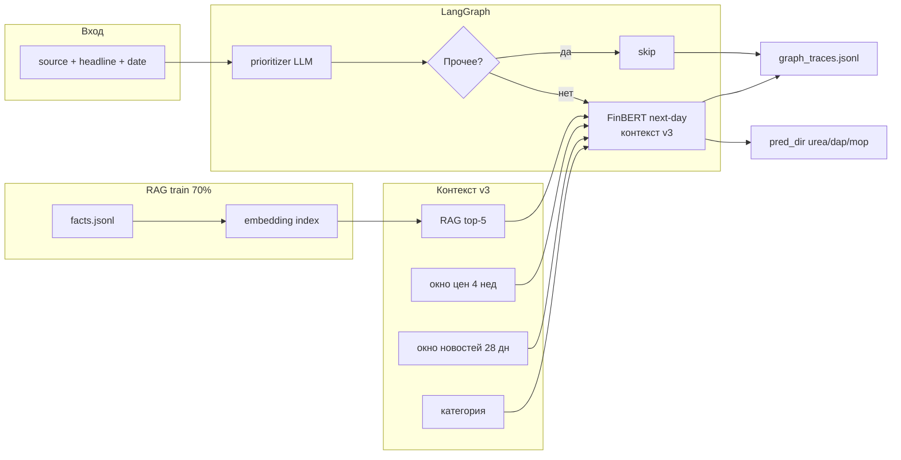

# Исследование: предсказание движения цен удобрений по новостям (v3)

Документ описывает построение и оценку варианта **v3** — системы, которая по заголовку новости предсказывает **направление** и **длительность** ценового режима (1–4 «дня»/недели) для urea, DAP и MOP. Также зафиксированы эволюция пайплайна (prioritizer, LangGraph, FinBERT) и **продуктовая ценность** для аналитиков.

---

## 1. Бизнес-задача

Аналитики рынка минеральных удобрений получают поток новостей (источник + заголовок). Нужно:

1. Отделить **рыночно значимые** новости от шума («Прочее»: ESG, кадры, конференции).
2. Для значимых — оценить **куда и как долго** могут двигаться цены **мочевины (urea)**, **DAP** и **MOP** после публикации.

Исходные зависимости между факторами (газ, фрахт, зерно, курс и т.д.) заданы в `Data_patterns.md` и используются в промптах, а не переобучаются моделью.

**Данные:**

| Файл | Содержание |
|------|------------|
| `market_news.csv` | ~370 новостей, 2020–2026, колонки: date, source, category, headline |
| `new_prices.csv` | Недельные котировки urea / dap / mop и факторы |

**Сплит:** хронологический 70% train / 30% test (`config.yaml → eval.train_ratio`). RAG-факты строятся только на train; предсказания и метрики — на test.

---

## 2. Как строился v3

### 2.1. Эволюция вариантов

| Вариант | Контекст | Целевая переменная |
|---------|----------|-------------------|
| **v1** | RAG-прецеденты | direction + weeks (0–7) |
| **v2** | RAG + **окно цен** (4 нед. до новости) | direction + weeks |
| **v3** | RAG + окно цен + **окно новостей** (28 дн.) | direction + **days (1–4)** |

v3 отражает запрос «не недельные серии, а короткие режимы после новости» с тем же недельным тиком цен в данных.

### 2.2. Ground truth для «дней» (days)

Реализация: `src/prices/streaks.py → compute_day_streak_for_product`.

Для каждой новости и продукта:

1. Берётся первая **недельная** котировка **на или после** даты новости.
2. Считаются последовательные недельные доходности (до 4 шагов).
3. Каждая неделя классифицируется: **up** / **down** / **flat** (`|return| ≤ 1%`, `streak.flat_threshold`).
4. **days** = число подряд идущих недель с **одним** направлением (cap 4).
5. **days = 0** — только если после новости нет котировок (не «боковик рынка»).

Важно: «1 день» в метриках = **1 неделя** наблюдаемого режима; flat может иметь days 1–4 (серия «боковых» недель).

### 2.3. RAG

1. `python -m src.cli build-rag` — LLM генерирует факты по train-новостям: source, headline → фактические серии после новости.
2. Индекс: `sentence-transformers/paraphrase-multilingual-MiniLM-L12-v2`, top-5 прецедентов на запрос.
3. При предсказании в контекст попадают похожие исторические кейсы.

### 2.4. Промпт v3

Файл: `prompts/streak_predict.yaml` (блок `variants.3`).

Модель получает:

- дату, источник, заголовок;
- **категорию** (см. §2.5);
- RAG-прецеденты;
- окно цен до новости;
- окно прошлых новостей с давностью в днях;
- доменные корреляции (газ → аммиак/urea, фрахт → MOP и т.д.).

Ответ (JSON schema): для каждого продукта `direction ∈ {up, down, flat}`, `days ∈ {1,2,3,4}`.

### 2.5. Двухшаговый пайплайн (prioritizer)

Чтобы не тратить прогноз на ESG/«Прочее» и явно разделить задачи:

```
Новость → [LLM Prioritizer: категория] → Прочее? → STOP
                                      → иначе → [Предиктор движения]
```

- Промпт prioritizer: тот же YAML, блок `prioritizer`.
- 8 категорий: Амmiак, Фосфаты, Калий, Энергоносители, Логистика, Макро/валюта, Спрос/агрорынок, **Прочее**.
- На test **20 из 111** (~18%) новостей отсеиваются; совпадение категории с разметкой CSV — **~96%**.

### 2.6. LangGraph

Оркестрация: `src/llm/predict_graph.py`.

```
START → categorize → [actionable?] → predict_next_day → finalize → END
                          ↓ нет
                    finalize_skip ────────────────────────────────┘
```

**GraphState** сохраняет:

- `category`, `prediction`, `skipped`;
- `step_timings_ms` (categorize, predict_next_day);
- `token_usage` (prompt / completion / total).

Трейсы: `outputs/graph_traces.jsonl`.

### 2.7. FinBERT (текущий предиктор движения)

Последняя итерация заменяет LLM-предсказание days на **FinBERT next-day**:

- Модуль: `src/finbert/next_day_predictor.py`
- **Тот же контекст v3** (категория, RAG, окно цен, окно новостей).
- Выход: только **направление** на следующую доступную котировку (up/down/flat), без days/weeks.
- Порог flat по score FinBERT: `finbert.flat_score_threshold = 0.1`.

Метрики **days** в §4 относятся к прогону **LLM v3 + prioritizer** (до FinBERT); для FinBERT используйте `eval` (next-day GT).

---

## 3. Запуск v3 и оценка

### 3.1. Подготовка окружения

```bash
pip install -r requirements.txt
# .env: OPENROUTER_API_KEY, OPENROUTER_MODEL
```

### 3.2. Полный цикл

```bash
# 1. RAG на train (один раз или при смене GT/промпта)
python -m src.cli build-rag

# 2. Предсказания на test (LangGraph + prioritizer + FinBERT)
python -m src.cli predict --variant 3 --no-cache --split test

# 3a. Метрики next-day (направление, FinBERT)
python -m src.cli eval --split test --variant 3

# 3b. Метрики days (направление + класс days 1–4, LLM v3)
#     — если в CSV есть pred_days_* (прогон LLM v3)
python -m src.cli eval-days --split test --variant 3

# 3c. Только рыночные новости (исключить GT «Прочее»)
python -m src.cli eval-days --exclude-category Прочее --output outputs/excl_prochee

# 3d. Сравнение порога flat 1% vs 2%
python -m src.cli eval-days-compare --thresholds 0.01,0.02
```

### 3.3. Выходные артефакты

| Файл | Назначение |
|------|------------|
| `outputs/predictions_v3.csv` | Предсказания (dir, category, timing, tokens) |
| `outputs/prioritizer_results.csv` | Категории и actionable-флаг |
| `outputs/graph_traces.jsonl` | Полный GraphState |
| `outputs/days_metrics.json` | Агрегаты eval-days |
| `outputs/days_direction_precision_plot.png` | Precision по классам days × direction |
| `outputs/days_direction_recall_plot.png` | Recall по классам days × direction |
| `outputs/days_scatter_plot.png` | true vs pred days |

### 3.4. Smoke-тесты

```bash
python -m pytest tests/test_predict_graph_smoke.py tests/test_finbert_next_day_smoke.py -v
```

---

## 4. Результаты на test (LLM v3 + prioritizer, n=91)

После фильтра «Прочее» (111 → **91** новость × 3 продукта = 273 прогноза направления).

**Flat threshold GT:** 1% недельного return.

### 4.1. Сводные метрики

| Метрика | Mean | urea | dap | mop |
|---------|-----:|-----:|----:|----:|
| **Direction accuracy** | **37.0%** | 45.1% | 27.5% | 38.5% |
| **Days class accuracy** | **57.1%** | 52.7% | 62.6% | 56.0% |

Для сравнения:

- Случайное угадывание направления ≈ **33%**.
- На полном test (111 новостей, без фильтра): dir **32.7%**, days **58.9%**.
- Без «Прочее» (91, post-hoc фильтр GT): dir **33.0%**, days **61.2%**.
- Двухшаговый prioritizer: dir **37.0%** (+4 п.п. к отфильтрованной выборке).

**Days class accuracy при true_days = 1** (основная масса выборки, 65–72 наблюдения на продукт): **70–72%** для urea/dap — модель чаще верно угадывает «короткий» режим, когда он действительно один шаг.

**Слабое место:** true_days = 2 (25 наблюдений urea) — accuracy days падает до **~8%**; модель систематически недооценивает двойные серии.

### 4.2. Precision / recall направления (true_days = 1)

Interpretation: среди случаев, когда GT-режим длится **1 неделю**, насколько точны предсказания up / down / flat.

| Продукт | Сигнал | Precision | Recall | Комментарий |
|---------|--------|----------:|-------:|-------------|
| **urea** | down | **58%** | **74%** | Сильный recall падений: большинство реальных down ловится; 58% срабатываний «down» — истинные |
| urea | up | 29% | 25% | Росты предсказываются слабо |
| urea | flat | 40% | 18% | Flat редко угадывается |
| **dap** | down | 35% | 40% | Умеренно |
| dap | up | 26% | 19% | Слабо |
| **mop** | down | 38% | 39% | Симметрично слабый сигнал |
| mop | flat | 43% | 32% | Лучший flat среди продуктов |

**Системный bias:** модель **перепредсказывает down** (особенно urea: 43 pred down vs 34 true down при days=1). Это согласуется с доменом: негативные заголовки («дешевеет», «слабый спрос») чаще и явнее в данных.

### 4.3. Категория «Прочее»

| Выборка | n | dir_acc | days_acc |
|---------|--:|--------:|---------:|
| Только «Прочее» | 20 | 31.7% | **48.3%** |
| Без «Прочее» | 91 | 37.0% | 57.1% |

Фильтрация «Прочее» **не magic bullet** для direction, но **+9 п.п. days_acc** относительно самой категории и снижение шума в рабочей очереди аналитика.

---

## 5. Продуктовая ценность для аналитиков

### 5.1. Что получает аналитик

Поток заголовков превращается в **структурированную очередь**:

1. **Категория** — к какому сегменту рынка относится новость (аммиак, логистика, макро…).
2. **Шум / не шум** — рыночно значимая новость или «Прочее».
3. **Горизонт влияния на цену** — **краткосрочное** (одна котировка) или **более длительное** (2–4 недели подряд в одном режиме).

Итого: **сортировка по категориям** + **понимание, имеет ли новость долгосрочный ценовой эффект** или её можно разобрать с меньшим приоритетом.

### 5.2. Горизонт влияния: «больше одного дня» или нет

Ключевой вопрос для desk: **повлияет ли новость на цену более чем на 1 день** (1 неделю котировок в наших данных)?

На test-выборке без «Прочее» (n=91), когда в ground truth эффект **действительно ограничен одним периодом** (`true_days = 1`, ~70% всех кейсов), модель v3 **верно определяет краткосрочный характер** в **~71–78%** случаев по продуктам (в среднем **~74%**):

| Продукт | Доля GT с `days = 1` | Точность «это 1 день, не дольше» |
|---------|---------------------:|----------------------------------:|
| urea | 65 | **71%** |
| dap | 72 | **78%** |
| mop | 59 | **75%** |

**Практический смысл:** если система показывает, что новость **не тянет цену дольше одного периода**, аналитик может **уделять таким материалам меньше внимания** — не игнорировать полностью, но не поднимать их в топ приоритета для пересмотра недельного прогноза, хеджа или клиентского комментария.

Обратная сторона: новости с **реальным много-периодным** эффектом (`days ≥ 2`) система пока распознаёт слабее — их стоит оставлять на ручной экспертизе. Продукт честно разделяет поток на «скорее короткий импульс» (~70%+ точность) и «возможно серия — проверь сам».

### 5.3. Отсеивание шумных новостей

~**18%** test-новостей — категория **«Прочее»** (ESG, кадры, конференции), без прямого рыночного эффекта.

Prioritizer отсекает их автоматически:

| Метрика | «Прочее» |
|---------|----------|
| **Precision** | **95.2%** |
| **Recall** | **100%** |

То есть если система пометила новость как «Прочее», в **95 из 100** случаев это подтверждается разметкой. Аналитик **не тратит время** на ~20 заголовков из 111 — они не попадают в очередь прогноза цен.

### 5.4. Точность прочих категорий

Общая точность категоризатора (exact match): **96.4%**.

| Категория | Precision | Recall |
|-----------|----------:|-------:|
| Аммиак | 100% | 100% |
| Калий | 100% | 100% |
| Макро/валюта | 100% | 100% |
| Спрос/агрорынок | 100% | 84.6% |
| Логистика | 92.3% | 100% |
| Фосфаты | 90.0% | 100% |
| Прочее | 95.2% | 100% |
| Энергоносители | 100% | 75.0% |

Ошибки — в основном **смежные** классы (газ ↔ аммиак, DAP ↔ спрос в Индии), а не случайный шум. Для аналитика это **маршрутизация в нужный доменный контекст** (какой продукт и фактор смотреть первым), а не финальный торговый сигнал.

### 5.5. Резюме ценности

| Задача аналитика | Что даёт продукт |
|------------------|------------------|
| Разобрать сотни заголовков | Авто-сортировка по **8 категориям** (96% точность) |
| Отфильтровать шум | **95% precision** на «Прочее», −18% потока |
| Понять, стоит ли углубляться | Оценка горизонта: **~70%+** точность на краткосрочных эффектах (1 период) |
| Долгосрочный vs краткосрочный эффект | Явная метка «1 день» vs «2–4» → приоритет очереди |

**Главная ценность:** не замена эксперта, а **интеллектуальная сортировка** — категория × рыночная релевантность × горизонт ценового влияния. Аналитик начинает не с пустого списка, а с **ранжированной ленты**, где шум отсеян, домен понятен, а короткие импульсы отделены от потенциально длинных серий.

### 5.6. Ограничения (честная рамка)

| Ожидание | Факт |
|----------|------|
| Замена аналитика | **Нет** — assistive AI |
| Автоторговля | **Нет** |
| Triage и приоритизация | **Да** — категории + «Прочее» + горизонт |
| Направление цены (up/down) | Умеренное качество (~37% dir_acc); использовать как черновик, не как сигнал |

---

## 6. Архитектура (итоговая схема)



---

## 7. Ключевые файлы репозитория

| Путь | Роль |
|------|------|
| `prompts/streak_predict.yaml` | Prioritizer + промпты v1–v3 |
| `src/llm/category_prioritizer.py` | Узел категоризации |
| `src/llm/streak_predictor.py` | LLM v3 (direction + days) |
| `src/finbert/next_day_predictor.py` | FinBERT direction |
| `src/llm/predict_graph.py` | LangGraph |
| `src/prices/streaks.py` | GT days 1–4 |
| `src/eval/days_metrics.py` | Метрики + графики precision/recall |
| `src/cli.py` | CLI: build-rag, predict, eval, eval-days |

---

## 8. Вывод

Продукт даёт аналитику **сортировку новостей по категориям** (96% точность) и **понимание горизонта ценового влияния** — краткосрочное (1 период) или потенциально более длинное.

Ключевые цифры:

- **~70%+** — точность определения краткосрочного эффекта («не более 1 дня/недели»), когда он действительно таков; аналитик может **снижать приоритет** таких новостей.
- **95% precision** — отсеивание шумных «Прочее»; ~18% потока не требует разбора.
- **90–100% precision** по большинству рыночных категорий — корректная маршрутизация в доменный контекст.

Система не заменяет эксперта, но превращает неструктурированный поток заголовков в **ранжированную рабочую очередь**: шум отфильтрован, категория понятна, долгосрочные эффекты отделены от краткосрочных.

---

*Последний прогон метрик days: `outputs/days_metrics.json`, n=91, prioritizer + LLM v3. FinBERT: см. `python -m src.cli eval`.*
